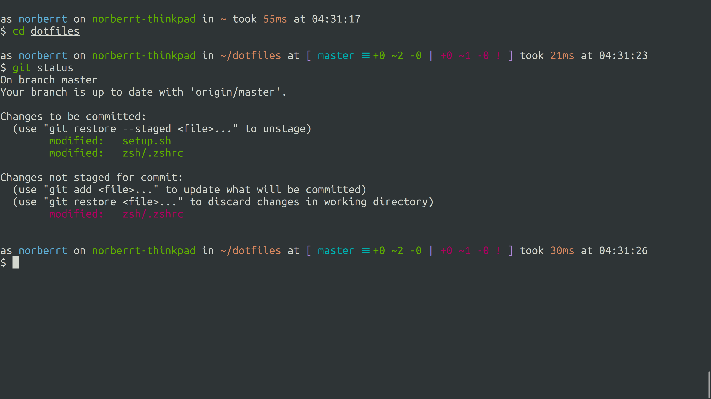

# Pedantic zsh theme

A zsh theme for those how pay attention to details. 
This theme has a promt with detailed information on your system and status of current git repository.
Theme is inspired by [dannynimmo/punctual-zsh-theme](https://github.com/dannynimmo/punctual-zsh-theme) and [lyze/posh-git-sh](https://github.com/lyze/posh-git-sh)



## Features

* Customisable colours & output
* Git branch & detailed status display, rebase and merge status 
* Username turns red when root
* Prompt turns red if the last command finishes with non-zero exit code

## Installation

### Oh My Zsh

1. Download [pedantic.zsh-theme](https://raw.githubusercontent.com/nemeshnorbert/pedantic-zsh-theme/master/pedantic.zsh-theme) into your custom theme directory, `$ZSH_CUSTOM/themes`
2. Update `ZSH_THEME="pedantic"` in your `~/.zshrc`
3. Open a new terminal and behold

### Antigen
Include the following line to `~/.zshrc` as part of your antigen setup (after any [configuration settings](#configuration)).
```zsh
antigen theme dannynimmo/punctual-zsh-theme punctual
```

## Configuration

You can change prompt style by setting environment variables before loading the theme, you can customise the output format by changing settings in your terminal or `.zshrc` file.

Example of settings that can be tweaked

```zsh
PEDANTIC_SHOW_HOSTNAME=false
PEDANTIC_CURRENT_DIR_COLOUR=yellow
```

For a full list see [pedantic.zsh-theme](https://github.com/nemeshnorbert/pedantic-zsh-theme/blob/master/pedantic.zsh-theme) file.
